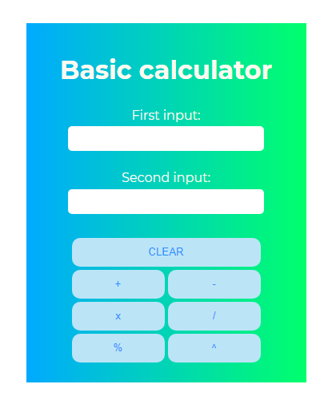

# Homework Calculator
> Homework de uma calculadora com operações básicas feita com HTML, CSS e JavaScript.

## Resultado final:

## Objetivo

* Implementar o conteúdo visto na aula de JS

## Desenvolvido com

* [Visual Studio Code](https://code.visualstudio.com/) - Editor de código fonte
