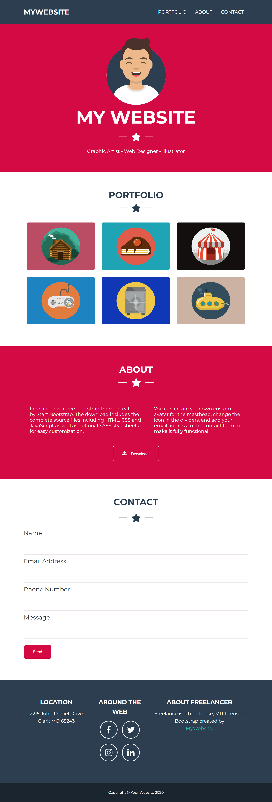

# Homework My Portfolio
> Segundo homework feito no intensivão de Front-End da Heroway

Resultado final:

Modelo proposto:
*[Visitar pasta img](https://github.com/Larissa1222/heroway-html-css/blob/main/my-portfolio/img/layout.png)
## Objetivo

* Recriar o site baseando no modelo proposto, assemelhando ao máximo.

## Desenvolvido com

* [Visual Studio Code](https://code.visualstudio.com/) - Editor de código fonte
* [Flat Icon](https://www.flaticon.com/) - Banco de icones gratuito.
